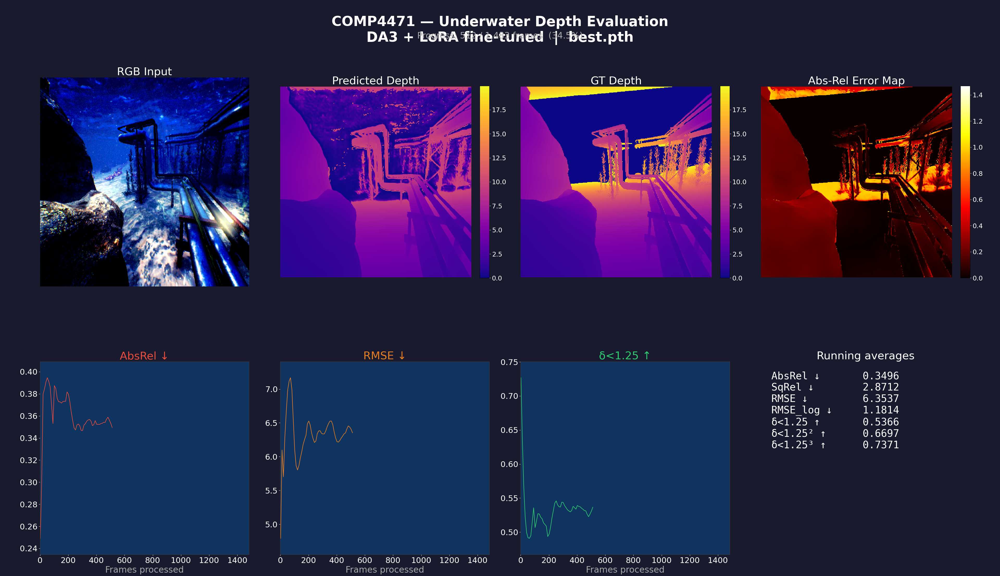
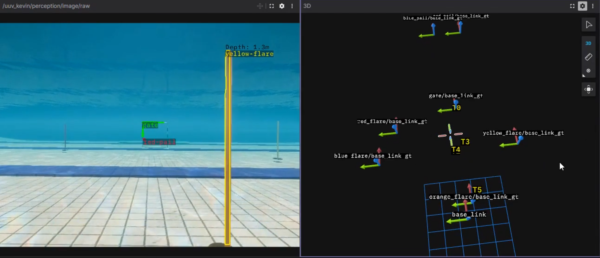

# Underwater DA3: LoRA Fine-Tuning of Depth Anything 3 for AUV Depth Estimation

<p align="center">
  
</p>

<p align="center">
  <a href="https://arxiv.org/abs/2511.10647"></a>
  <a href="https://huggingface.co/Frieddeli/COMP4471"></a>
  <a href="https://github.com/remaro-network/MIMIR-UW"></a>
  
  
  
  
</p>

<p align="center">
  <a href="https://alvin0523.github.io/Depth-Anything-3-Underwater-Refinement/"></a>
</p>

<p align="center">
  <strong>LoRA fine-tuning of DA3 Mono Metric Large for underwater metric depth estimation — integrated into a full AUV target localisation pipeline with YOLOv11-seg and SQ-UKF tracking.</strong>
</p>

> **Fork of [ByteDance-Seed/Depth-Anything-3](https://github.com/ByteDance-Seed/Depth-Anything-3).** All fine-tuning, evaluation, and AUV integration code lives in [`train/`](train/).

---

## 📖 About

DA3 (Depth Anything 3) achieves state-of-the-art metric depth on terrestrial benchmarks but fails dramatically underwater — wavelength-dependent light attenuation causes a blue-green colour cast, and backscatter reduces contrast. We adapt DA3 Mono Metric Large to the underwater domain via rank-8 LoRA fine-tuning and integrate it into a full ROS 2 AUV localisation pipeline.

| Component | Role |
|---|---|
| `train/` | LoRA fine-tuning pipeline (dataset → training → evaluation) |
| YOLOv11-seg | Instance segmentation — per-object binary masks |
| DA3 Mono Metric Large | Per-pixel metric depth from a single RGB frame |
| Mask × Depth fusion | Aggregates valid depth pixels per mask → per-object distance |
| SQ-UKF tracker | Temporally persistent object tracks published as ROS 2 TF frames |

### 🤗 Hugging Face

| Type | Link |
|---|---|
| Fine-tuned checkpoint | [Frieddeli/COMP4471](https://huggingface.co/Frieddeli/COMP4471) |

---

## 📁 Project Structure

```
Depth-Anything-3-Underwater-Refinement/
├── train/                   # ← all fine-tuning code (our contribution)
│   ├── dataset.py           # MIMIR-UW loader + physics-aware preprocessing
│   ├── lora.py              # LoRA injection into DINOv2-L attention blocks
│   ├── losses.py            # SILog (+ scale anchor) + Sobel gradient loss
│   ├── train.py             # main training script
│   ├── evaluate.py          # benchmarking (AbsRel, RMSE, δ<1.25)
│   ├── demo_eval.py         # live matplotlib evaluation demo
│   └── test_lora_pipeline.py# smoke test — run before training on HPC
├── src/depth_anything_3/    # original DA3 package (installed via pixi)
│   ├── model/da3.py         # DepthAnything3Net (DINOv2-L + DPT head)
│   ├── model/dinov2/        # DINOv2 ViT backbone
│   └── configs/             # YAML model configs
├── results/                 # benchmark outputs (JSON, CSV, visualisations)
├── media/                   # training curves, qualitative comparison figures
├── report/                  # CVPR-style Typst report (main.typ)
├── docs/                    # extended documentation
│   ├── quickstart.md        # environment setup + first run
│   ├── dataset.md           # MIMIR-UW format, preprocessing, splits
│   ├── implementation.md    # what each file implements
│   └── operation-guide.md   # full HPC training + evaluation workflow
├── pyproject.toml           # package + Pixi workspace config
└── README.md
```

---

## 🚀 Quick Start

**1. Install [Pixi](https://pixi.sh/) (one-time):**

```bash
curl -fsSL https://pixi.sh/install.sh | bash
```

**2. Clone and install:**

```bash
git clone https://github.com/Alvin0523/Depth-Anything-3-Underwater-Refinement-.git
cd Depth-Anything-3-Underwater-Refinement
pixi install
```

**3. Smoke test (no data needed — verifies the full LoRA pipeline):**

```bash
pixi run python train/test_lora_pipeline.py
# Expected: ALL CHECKS PASSED
```

**4. Run fine-tuned evaluation against the MIMIR-UW SeaFloor benchmark:**

```bash
pixi run python train/evaluate.py \
  --data_root /path/to/SeaFloor \
  --model_name da3metric-large \
  --checkpoint checkpoints/best.pth \
  --lora_rank 8 --lora_alpha 16.0 \
  --dataset_type seafloor \
  --batch_size 2 --num_workers 2 \
  --vis_dir results/vis_finetuned \
  --out_json results/finetuned.json \
  --per_image_csv results/finetuned_per_image.csv
```

👉 For full HPC training, NSCC job scripts, and the complete workflow — see [docs/operation-guide.md](docs/operation-guide.md).

---

## 📊 Benchmark — MIMIR-UW SeaFloor Dataset

Evaluated on the held-out [MIMIR-UW SeaFloor](https://github.com/remaro-network/MIMIR-UW) benchmark — 14,828 frames across 3 tracks × 2 front cameras with metric ground-truth depth stored as inverse-depth EXR files.

| Model | AbsRel ↓ | SqRel ↓ | RMSE ↓ | RMSE_log ↓ | δ<1.25 ↑ | δ<1.25² ↑ | δ<1.25³ ↑ |
|---|---|---|---|---|---|---|---|
| DA3 Mono Metric Large (zero-shot) | 0.7744 | 5.9656 | 8.3562 | 1.6430 | 0.94% | 2.16% | 3.81% |
| **DA3 + LoRA fine-tuned (ours)** | **0.3196** | **2.7898** | **6.4019** | **1.1234** | **56.8%** | **69.6%** | **75.6%** |

> LoRA fine-tuning achieves a **59% reduction in AbsRel** over the zero-shot baseline, with δ<1.25 accuracy improving from 0.94% → 56.8%.
> **Checkpoint:** [`Frieddeli/COMP4471`](https://huggingface.co/Frieddeli/COMP4471) on HuggingFace.

### SeaFloor Benchmark Frame Breakdown

| Track | Frames |
|---|---|
| track0 | 2,847 × 2 cams = 5,694 |
| track1 | 2,030 × 2 cams = 4,060 |
| track2 | 2,537 × 2 cams = 5,074 |
| **Total** | **14,828** |

---

## 🏗️ System Architecture

```
Camera feed (monocular RGB)
    ├─── [Branch A] YOLOv11-seg (TensorRT) ──► instance masks
    └─── [Branch B] DA3 Mono Metric Large  ──► per-pixel depth map (metres)
              ▼
    Mask × Depth Fusion
    (median depth within each segmentation mask)
              ▼
    "Gate at 2.3 m" — ROS 2 topic
              ▼
    SQ-UKF Tracker (Hungarian association)
              ▼
    TF frames → AUV navigation
```



> ROS 2 Jazzy running inside the NTU Mecatron Unity simulation. **Left:** YOLOv11-seg detections with per-object depth estimates. **Right:** Foxglove 3D panel showing SQ-UKF tracks (T0–T5) alongside ground-truth TF frames for gate, flares, and buckets.

---

## 🔬 What We Did

- **LoRA fine-tuning** — rank-8 LoRA on all DINOv2-L attention projections (q/k/v/out); ~9.24% trainable params (~3M LoRA + fully trainable DPT head of ~300M total)
- **MIMIR-UW training data** — 9,987 SeaFloor Algae RGB+depth pairs from the [MIMIR-UW](https://github.com/remaro-network/MIMIR-UW) synthetic underwater dataset (remaro-network); depth stored as float32 inverse-depth (1/metres) and inverted at load time
- **Physics-aware preprocessing** — Gray World white balance + percentile histogram stretching (2nd–98th) applied at train and inference time
- **Combined loss** — SILog with scale anchor term (`+ 0.1·|mean(g)|`) + Sobel gradient loss; scale anchor prevents AbsRel divergence when variance-focus cancels global scale penalty
- **Depth model adaptation** is the primary contribution of this repo — the full AUV deployment pipeline (Unity simulation, real pool testing, ROS 2 localisation with SQ-UKF and TF frames) was developed collaboratively as part of [NTU Mecatron](https://github.com/mecatron); pipeline code is withheld as it is actively used in competition

---

## 🗺️ Roadmap & Status

| Task | Status | Notes |
|---|---|---|
| LoRA fine-tuning pipeline | ✅ Complete | `train/train.py`, best checkpoint at epoch 27 |
| MIMIR-UW SeaFloor benchmark | ✅ Complete | 14,828 frames, results in `results/` |
| Physics-aware preprocessing | ✅ Complete | `train/dataset.py` |
| ROS 2 localisation integration | ✅ Complete | YOLOv11-seg + DA3 + SQ-UKF (not disclosed) |
| Real pool test (physical AUV) | ✅ Complete | Validated in pool with real footage from NTU Mecatron |
| Qualitative visualisations | ✅ Complete | `media/qual_*.png` |
| Multi-environment domain adaptation | ⏳ Planned | True underwater domain shift (OceanFloor, SandPipe, open water) |

---

## 📚 Documentation

| Guide | Contents |
|---|---|
| [Quick Start](docs/quickstart.md) | Environment setup, smoke test, first evaluation run |
| [Dataset](docs/dataset.md) | MIMIR-UW format, inverse depth, preprocessing, splits |
| [Implementation](docs/implementation.md) | What each file in `train/` implements |
| [Operation Guide](docs/operation-guide.md) | Full HPC training workflow, NSCC job scripts |
| [CLI](docs/CLI.md) | Original DA3 command-line interface |
| [API](docs/API.md) | Original DA3 Python API |
| [Benchmark](docs/BENCHMARK.md) | Original DA3 benchmark evaluation |

---

## 📜 Citation

```bibtex
@article{lin2025da3,
  title   = {Depth Anything 3: Recovering the Visual Space from Any Views},
  author  = {Lin, Hengkai and others},
  journal = {arXiv preprint arXiv:2511.10647},
  year    = {2025}
}

@inproceedings{alvarez2023mimir,
  title     = {MIMIR: A Multipurpose Underwater Robotics Dataset for Sim-to-Real Transfer},
  author    = {Álvarez-Tuñón, Olaya and others},
  booktitle = {IROS},
  year      = {2023}
}

@article{hu2021lora,
  title   = {LoRA: Low-Rank Adaptation of Large Language Models},
  author  = {Hu, Edward J. and others},
  journal = {arXiv preprint arXiv:2106.09685},
  year    = {2021}
}
```

---

## 👥 Authors

HKUST COMP4471 — Course Project

[](https://github.com/Alvin0523)
[](https://github.com/frieddeli)
[](https://github.com/dnyk7)


| Name | GitHub |
|---|---|
| Wong Wei Ming | [@Alvin0523](https://github.com/Alvin0523) |
| Shao Ying Zhan | [@frieddeli](https://github.com/frieddeli) |
| Dana Yak | [@dnyk7](https://github.com/dnyk7) |

---

## 🙌 Acknowledgements

- [ByteDance-Seed/Depth-Anything-3](https://github.com/ByteDance-Seed/Depth-Anything-3) — base model and DA3 package
- [NTU Mecatron](https://github.com/mecatron) — Unity simulation engine for full AUV pipeline testing and real pool footage; we are part of the Mecatron team
- [remaro-network/MIMIR-UW](https://github.com/remaro-network/MIMIR-UW) — synthetic underwater dataset used for fine-tuning
- [facebookresearch/dinov2](https://github.com/facebookresearch/dinov2) — DINOv2-L backbone
- [NSCC Singapore](https://www.nscc.sg/) — A100 GPU compute

